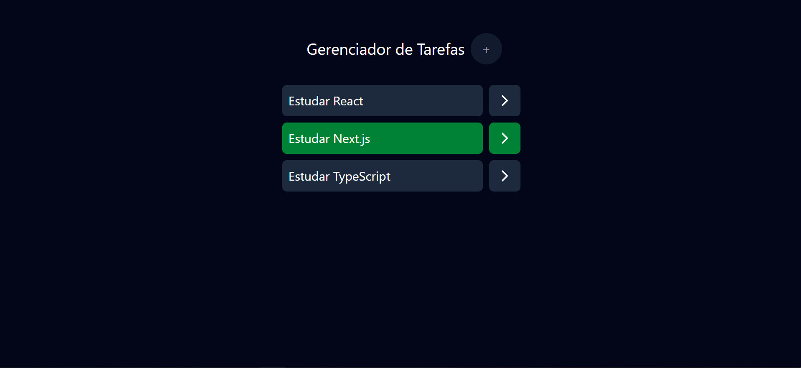

### Criando App Todo Compoments com JSX + TailwindCSS
```
npm create vite@5.5.2 todo-react 
```



#### TailwindCSS
##### 1. passo
```
npm install tailwindcss @tailwindcss/vite
```

##### 2. passo vite.config.js
```
import { defineConfig } from 'vite'
import react from '@vitejs/plugin-react'
import tailwindcss from '@tailwindcss/vite'

// https://vitejs.dev/config/
export default defineConfig({
  plugins: [
    react(),
    tailwindcss(),
  ],
})
```

##### index.css
```
@import "tailwindcss";
```

* ref.: start no minuto 15h
* duvida editar 58:30
* duvida editar 1:06 -- inciando form-add
```
https://alunos.fullstackclub.com.br/area/produto/item/5175249
```